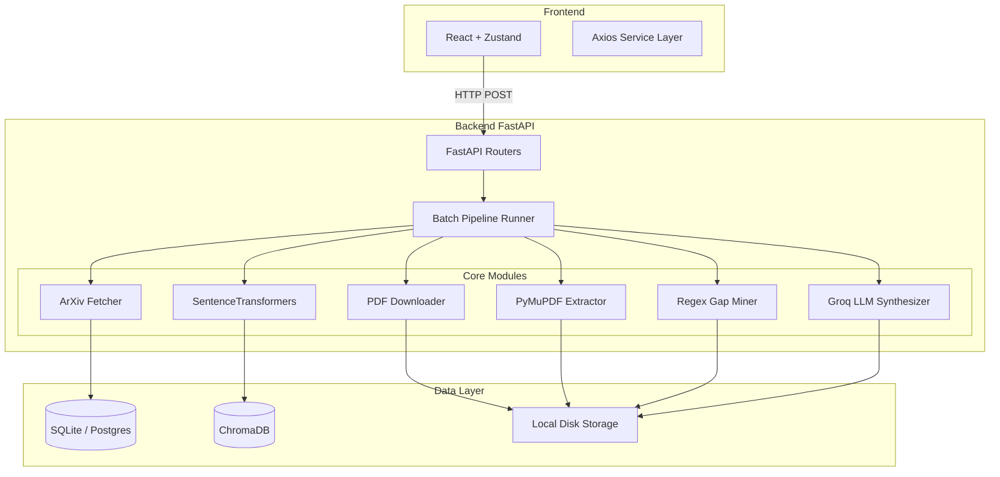
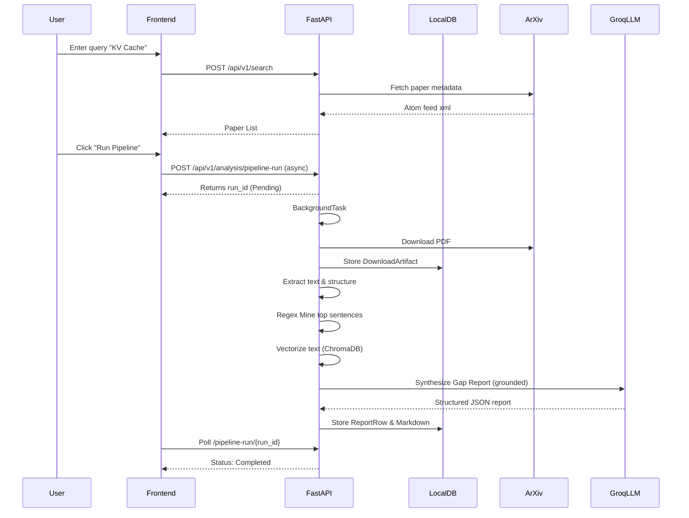

# System Design & Architecture

The AI Research Gap Identifier is a robust, local-first pipeline designed to ingest unstructured scientific PDFs and deterministically output grounded research gaps.

## Component Architecture

## Request Lifecycle Sequence

